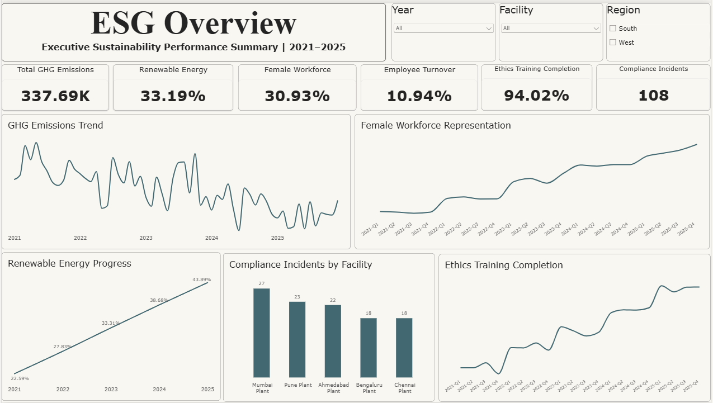
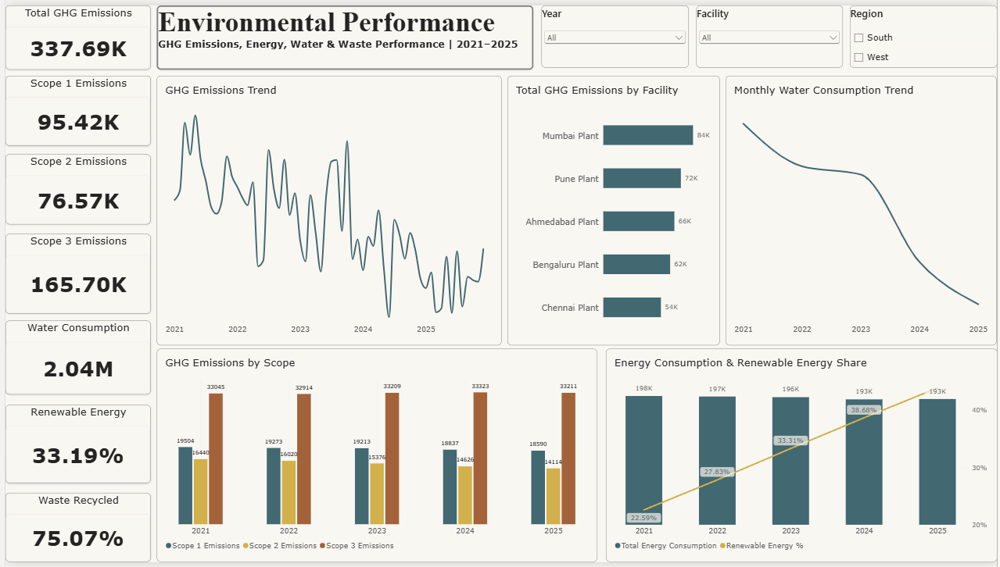
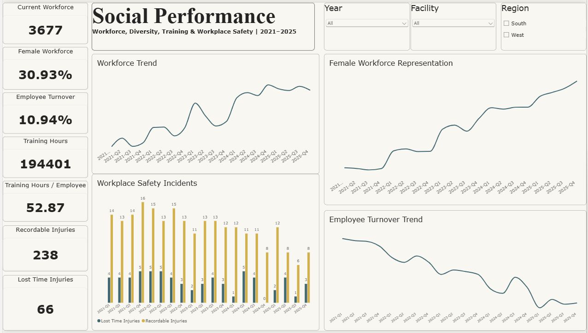
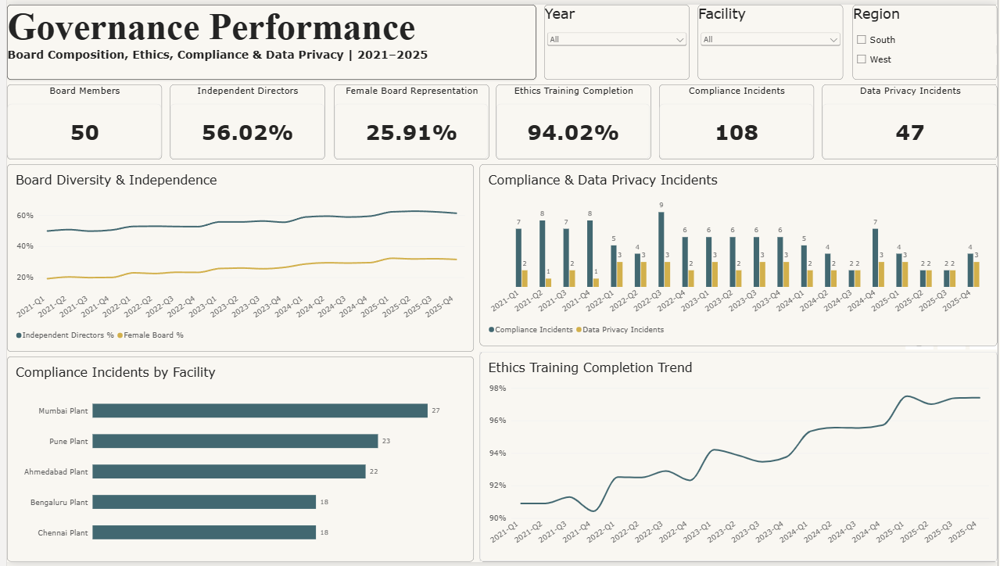

# EcoManufacture ESG Analytics

## ESG Performance Dashboard & Sustainability Report | 2021–2025

An end-to-end ESG analytics portfolio project demonstrating how data analytics and business intelligence techniques can be used to monitor Environmental, Social, and Governance performance.

The project covers ESG performance across five manufacturing facilities over a five-year period and includes an interactive Power BI dashboard, ESG KPI analysis, target tracking, and a sustainability performance report.

> **Disclaimer:** EcoManufacture Ltd. is a fictional company created for portfolio and educational purposes. All ESG data in this project is simulated and does not represent the actual performance of a real organization.

---

## 📌 Project Overview

The objective of this project is to transform structured ESG data into meaningful business insights that can support sustainability monitoring, performance evaluation, and management decision-making.

The analysis covers:

- Environmental performance
- Social performance
- Governance performance
- ESG targets and progress
- Facility-level performance
- Sustainability trends from 2021–2025
- Key ESG risks and improvement areas

---

## 🏭 Company Background

**EcoManufacture Ltd.** is a fictional Indian manufacturing company operating across five facilities in West and South India.

### Facilities

| Facility | Region | State | Size |
|---|---|---|---|
| Mumbai Plant | West | Maharashtra | Large |
| Pune Plant | West | Maharashtra | Medium |
| Ahmedabad Plant | West | Gujarat | Medium |
| Bengaluru Plant | South | Karnataka | Medium |
| Chennai Plant | South | Tamil Nadu | Small |

---

# 📊 Dataset

The project uses a simulated ESG dataset covering **2021–2025**.

### Environmental

Includes:

- Scope 1 emissions
- Scope 2 emissions
- Scope 3 emissions
- Energy consumption
- Renewable energy consumption
- Water consumption
- Waste generated
- Waste recycling percentage
- Production output

### Social

Includes:

- Total employees
- Female employees
- Female workforce percentage
- Employee exits
- Employee turnover
- Training hours
- Recordable injuries
- Lost-time injuries

### Governance

Includes:

- Board members
- Independent directors
- Female board representation
- Ethics training completion
- Compliance incidents
- Data privacy incidents

### Supporting tables

- Facilities
- Calendar
- ESG Targets
- Data Dictionary
- README / methodology information

---

# 🛠️ Tools & Technologies

- **Microsoft Power BI**
- **Power Query**
- **DAX**
- **Microsoft Excel**
- **Data Modeling**
- **Data Visualization**
- **ESG KPI Analysis**

---

# 🔄 Data Analytics Workflow

Simulated ESG Dataset
        ↓
Microsoft Excel
        ↓
Power Query
        ↓
Data Cleaning & Transformation
        ↓
Power BI Data Model
        ↓
Relationships & Dimensions
        ↓
DAX Measures
        ↓
ESG KPI Analysis
        ↓
Interactive Power BI Dashboard
        ↓
Sustainability Performance Report


# 📐 Data Modeling

The Power BI model uses separate fact and dimension tables.

Main fact tables
Environmental
Social
Governance
Dimension tables
Facilities
Calendar
Quarter
DimYear
Additional table
Targets

The model was designed to allow filtering by:

Year
Facility
Region

while maintaining appropriate relationships between the ESG datasets.

# 🧮 Key DAX Measures

Examples of measures created in Power BI include:

Total GHG Emissions
Total GHG Emissions =
SUM('Environmental'[Scope 1 Emissions (tCO2e)])
+
SUM('Environmental'[Scope 2 Emissions (tCO2e)])
+
SUM('Environmental'[Scope 3 Emissions (tCO2e)])
Renewable Energy %
Renewable Energy % =
DIVIDE(
    SUM('Environmental'[Renewable Energy (MWh)]),
    SUM('Environmental'[Energy Consumption (MWh)])
)
Female Workforce %
Female Workforce % =
DIVIDE(
    SUM('Social'[Female Employees]),
    SUM('Social'[Total Employees])
)
Waste Recycling %
Waste Recycling % =
DIVIDE(
    SUMX(
        'Environmental',
        'Environmental'[Waste Generated (tonnes)]
            * 'Environmental'[Waste Recycled (%)]
    ),
    SUM('Environmental'[Waste Generated (tonnes)]) * 100
)

Additional DAX measures were created for emissions, energy, water, waste, workforce, turnover, training, safety, board composition, ethics, compliance, and data privacy.

# 🌱 Environmental Performance

The Environmental dashboard monitors:

GHG emissions
Scope 1 emissions
Scope 2 emissions
Scope 3 emissions
Energy consumption
Renewable energy adoption
Water consumption
Waste generation
Waste recycling
Key 2021–2025 observations
Scope 1 and Scope 2 emissions declined over the period.
Renewable energy adoption increased significantly.
Water consumption showed a gradual improvement.
Waste recycling performance improved toward the 2025 target.
Scope 3 emissions remained relatively stable compared with Scope 1 and Scope 2.

# 👥 Social Performance

The Social dashboard focuses on:

Workforce size
Female workforce representation
Employee turnover
Training
Workplace safety
Recordable injuries
Lost-time injuries
Key observations
Workforce increased from approximately 13,700 to 14,700 employees.
Female workforce representation increased to approximately 34.6% in 2025.
Employee turnover declined substantially.
Training investment increased each year.
Recordable injuries declined from 57 to 34.
Lost-time injuries also decreased over the period.
🏛️ Governance Performance

The Governance dashboard monitors:

Board composition
Independent directors
Female board representation
Ethics training
Compliance incidents
Data privacy incidents
Key observations
Independent director representation increased.
Female board representation improved consistently.
Ethics training completion increased to approximately 97.3% in 2025.
Compliance incidents declined from 30 to 12.
Data privacy incidents remained an area requiring continued monitoring.

# 🎯 ESG Target Tracking

The project includes a target framework for 2025.

ESG Metric	2025 Performance	Target	Status
Scope 1 + 2 Emissions Reduction	~9.0%	20% reduction	Not Achieved
Renewable Energy	43.9%	45%	Near Target
Waste Recycling	~83.4%	85%	Near Target
Female Workforce	34.6%	35%	Near Target
Employee Turnover	9.4%	<9%	Not Achieved
Recordable Injuries Reduction	~40.4%	25% reduction	Achieved
Ethics Training	97.3%	98%	Near Target
Compliance Incidents Reduction	60%	30% reduction	Achieved

# 📈 Power BI Dashboard

The Power BI solution contains four interactive dashboard pages designed to monitor ESG performance across facilities and years.

## ESG Overview

Executive-level summary of key Environmental, Social and Governance indicators.



## Environmental Performance

GHG emissions, energy consumption, renewable energy, water consumption and waste performance.



## Social Performance

Workforce, diversity, employee turnover, training and workplace safety.



## Governance Performance

Board composition, independence, diversity, ethics, compliance and data privacy.




# 💡 Key Business Insights

The analysis highlights several areas for management attention:

Environmental

The company has made progress in renewable energy adoption and Scope 1–2 emissions reduction, but the emissions reduction target remains challenging.

Social

Workforce diversity and safety performance are improving, while employee turnover remains slightly above the desired target.

Governance

Governance indicators show strong improvement in board independence, diversity, ethics training, and compliance performance.

Overall

The strongest improvements are visible in:

Workplace safety
Compliance
Renewable energy adoption
Board independence
Ethics training

Areas requiring continued improvement include:

Scope 1 + 2 emissions reduction
Employee turnover
Renewable energy target achievement
Waste recycling
Female workforce representation
📄 Sustainability Report

A detailed sustainability performance report accompanies the Power BI dashboard.

The report includes:

Executive summary
ESG performance analysis
Environmental performance
Social performance
Governance performance
ESG target assessment
Key ESG risks
Recommendations
2026 priorities
Methodology
Data limitations
Facility coverage

The report also contains editable charts generated from the analyzed ESG data.

# 🚀 Recommendations & 2026 Priorities

Based on the analysis, the following priorities are recommended:

Accelerate renewable energy adoption toward and beyond the 45% target.
Develop additional Scope 1 and Scope 2 emissions reduction initiatives.
Investigate the drivers of employee turnover.
Continue improving female workforce representation.
Increase waste recycling to exceed the 85% target.
Maintain strong workplace safety programs.
Strengthen data privacy monitoring and controls.
Continue improving ethics training completion.

# 📁 Repository Structure

```text
EcoManufacture-ESG-Analytics/
│
├── README.md
│
├── data/
│   └── EcoManufacture_ESG_Portfolio_Dataset_v2.xlsx
│
├── Power BI/
│   └── EcoManufacture_ESG_Dashboard.pbix
│
├── Report/
│   └── EcoManufacture_ESG_Sustainability_Report_2021_2025_EDITABLE_CHARTS.docx
│
└── Screenshots/
    ├── ESG_Overview.png
    ├── Environmental_Performance.png
    ├── Social_Performance.png
    └── Governance_Performance.png

```
# 📂 Project Files

| Resource | Description |
|---|---|
| [📊 Power BI Dashboard](Power%20BI/EcoManufacture_ESG_Dashboard.pbix) | Interactive ESG dashboard |
| [📁 ESG Dataset](data/EcoManufacture_ESG_Portfolio_Dataset_v2.xlsx) | Consolidated Excel ESG dataset |
| [📄 Sustainability Report](Report/EcoManufacture_ESG_Sustainability_Report_2021_2025_EDITABLE_CHARTS.docx) | Detailed ESG sustainability report |
| [🖼️ Dashboard Screenshots](Screenshots/) | Dashboard page previews |

# ⚠️ Data Disclaimer

This project is intended for portfolio and educational purposes.

EcoManufacture Ltd. is a fictional organization and the ESG dataset is simulated. The figures should not be interpreted as actual corporate sustainability disclosures or verified ESG performance.

The project demonstrates the application of data analytics, business intelligence, ESG KPI monitoring, data modeling, visualization, and sustainability reporting techniques.

# 👤 Author

**Mayur Khadse**

Data Analyst | Power BI | SQL | Excel | Tableau | Python | ESG Analytics

This project demonstrates the combination of **data analytics and sustainability/ESG analysis** to transform structured data into actionable business insights.
